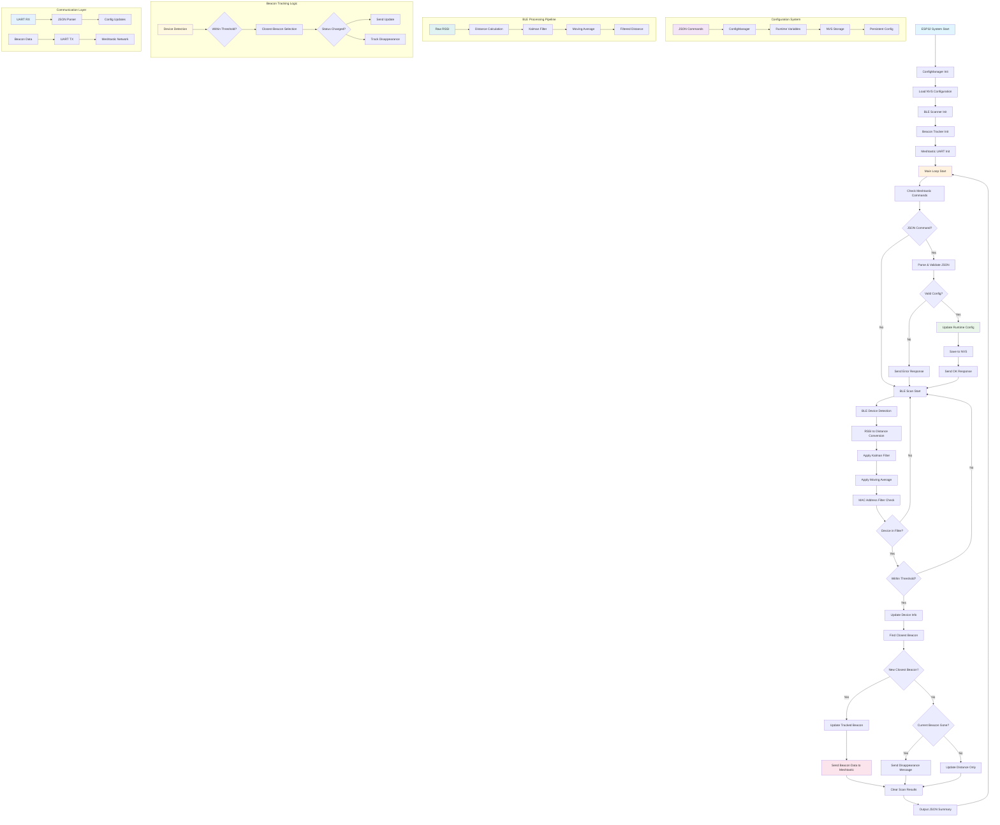
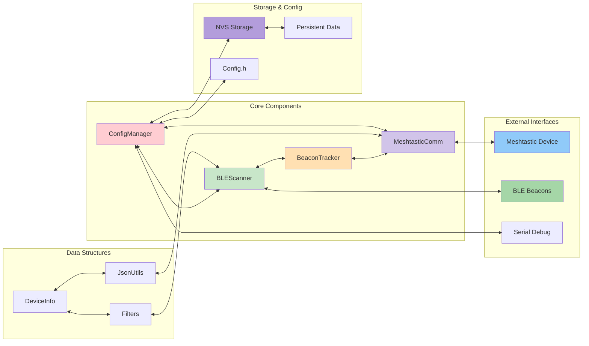

# BLE Beacon Scanner with Dynamic Configuration

A comprehensive BLE beacon tracking system for ESP32 with real-time configuration via Meshtastic UART communication. This tutorial will guide you through understanding, setting up, and using this advanced beacon tracking system, even if you're new to ESP32 or BLE technology.

## What This System Does

Imagine you want to track people, objects, or vehicles in real-time using small Bluetooth beacons. This system acts as a smart gateway that:

1. **Continuously scans** for Bluetooth Low Energy (BLE) beacons in the area
2. **Calculates distances** to each beacon using radio signal strength
3. **Tracks the closest beacon** and detects when it moves or disappears
4. **Sends updates** to a Meshtastic mesh network for long-range communication
5. **Accepts remote commands** to change settings without physical access

Think of it as a "smart radar" for Bluetooth beacons that can be controlled remotely through a mesh network.

## Real-World Applications

- **Asset Tracking**: Monitor equipment, vehicles, or valuable items
- **Personnel Safety**: Track workers in hazardous environments  
- **Smart Home**: Detect presence of family members or pets
- **Industrial IoT**: Monitor machinery or inventory locations
- **Search & Rescue**: Track team members in remote areas via mesh network

## How It Works - The Big Picture

The system uses several advanced techniques to provide accurate, reliable tracking:

### 1. BLE Scanning
Your ESP32 continuously listens for Bluetooth advertisements from nearby beacons. Unlike regular Bluetooth, BLE devices constantly broadcast small packets of information that can be received without pairing.

### 2. Distance Calculation  
The system measures the signal strength (RSSI) of each beacon and converts it to approximate distance using physics-based calculations. It accounts for environmental factors like walls, interference, and different beacon types.

### 3. Smart Filtering
Raw radio measurements are noisy and unreliable. The system applies two layers of filtering:
- **Kalman Filter**: A mathematical technique used in GPS and aerospace to smooth out measurement noise
- **Moving Average**: Combines several recent measurements for stability

### 4. Intelligent Tracking
The system doesn't just detect beacons - it intelligently tracks them:
- Identifies the closest beacon within your specified range
- Detects when beacons move closer or further away
- Notices when beacons disappear (person walked away, battery died, etc.)
- Switches tracking to a new closest beacon automatically

### 5. Mesh Network Communication
Instead of WiFi or cellular, the system uses Meshtastic - a mesh network that can relay messages across multiple nodes without internet infrastructure. Perfect for remote areas or emergency situations.

### 6. Remote Configuration
Here's where it gets really powerful: you can change any setting remotely by sending simple text messages through the mesh network. No need to physically access the device or reprogram it.

## Features

### Core Functionality
- **BLE Device Scanning**: Continuous scanning for BLE beacons in the environment using advanced ESP32 Bluetooth capabilities
- **Distance Calculation**: RSSI to meters conversion using scientifically-validated log-distance path loss model
- **Advanced Filtering**: Dual-layer filtering system combining Kalman filter and moving average for exceptional accuracy
- **Closest Beacon Tracking**: Automatic detection and tracking of the nearest beacon with intelligent switching
- **Disappearance Detection**: Smart detection when beacons go out of range, with configurable timeout periods
- **JSON Communication**: Structured, human-readable data output via UART to Meshtastic devices

### Dynamic Configuration (NEW!)
- **Real-time Parameter Updates**: Change all settings via simple JSON commands over Meshtastic UART - no programming required
- **Persistent Storage**: Configuration survives reboots using ESP32's built-in Non-Volatile Storage (NVS)
- **MAC Address Management**: Add/remove device filters individually - perfect for managing multiple beacons
- **No Restart Required**: All changes take effect immediately without interrupting operation
- **Configuration Validation**: Automatic validation and error reporting prevents invalid settings

### Communication
- **UART to Meshtastic**: Sends beacon data and receives configuration commands through reliable serial communication
- **JSON Format**: Standardized, easy-to-read data exchange format that's both human and machine readable
- **Acknowledgments**: Confirms successful configuration changes so you know commands were received
- **Debug Output**: Comprehensive logging for troubleshooting and system monitoring

## Understanding the Hardware

### What You Need

**ESP32 Development Board**: The brain of the system. We recommend the Seeed XIAO ESP32-S3 for its small size and built-in BLE capabilities. Any ESP32 with Bluetooth will work.

**Meshtastic Device**: This could be another ESP32 running Meshtastic firmware, or a commercial Meshtastic device like T-Beam or Heltec. This handles the mesh network communication.

**BLE Beacons**: The devices you want to track. These can be:
- Commercial BLE beacons (Estimote, Kontakt.io, etc.)
- Smartphones with BLE apps
- Custom ESP32 devices programmed as beacons
- Fitness trackers or smartwatches
- AirTags or similar tracking devices

**Connections**: Just 4 wires connect your ESP32 to the Meshtastic device.

## Hardware Setup Tutorial

### Step 1: Understanding the Connections

The ESP32 talks to your Meshtastic device through a simple serial connection (UART). Think of it like an old-fashioned telephone line - data goes back and forth through two wires.

### Step 2: Wiring

Connect the devices according to this table:

| ESP32 Pin | Meshtastic Pin | Purpose | Wire Color Suggestion |
|-----------|----------------|---------|----------------------|
| GPIO 43   | RX (Receive)   | ESP32 sends data → Meshtastic | Blue |
| GPIO 44   | TX (Transmit)  | Meshtastic sends data → ESP32 | Green |
| GND       | GND (Ground)   | Common electrical reference | Black |
| VCC       | 3.3V or 5V     | Power supply | Red |

**Important**: The TX (transmit) pin on one device connects to RX (receive) on the other, and vice versa. This creates the communication link.

### Step 3: Power Considerations

- If both devices have their own power supplies (USB, battery), you only need to connect GND, TX, and RX
- If you're powering the ESP32 from the Meshtastic device, also connect the power lines
- Check voltage compatibility - some devices use 3.3V, others 5V

## Software Installation Tutorial

### Step 1: Setting Up Your Development Environment

**Install PlatformIO**: This is a professional development environment that makes ESP32 programming much easier than Arduino IDE.

1. Install Visual Studio Code (free)
2. Add the PlatformIO extension
3. Create a new project and select your ESP32 board

### Step 2: Project Configuration

Create a `platformio.ini` file with these settings. This tells PlatformIO what libraries to download and how to compile your code:

```ini
[env:seeed_xiao_esp32s3]
platform = espressif32@6.8.0
board = seeed_xiao_esp32s3
framework = arduino
monitor_speed = 115200
build_unflags = -std=gnu++11
build_flags = 
    -std=gnu++17
    -DCORE_DEBUG_LEVEL=0
lib_deps =
    h2zero/NimBLE-Arduino @ 1.4.0
    knolleary/PubSubClient @ ^2.8
    bblanchon/ArduinoJson @ ^6.21.3
```

**What these libraries do**:
- **NimBLE-Arduino**: Provides efficient Bluetooth Low Energy functionality
- **PubSubClient**: MQTT communication (for future expansion)  
- **ArduinoJson**: Handles JSON parsing and generation for configuration commands

### Step 3: Code Structure

The system is built with multiple files, each handling a specific function. This makes it easier to understand and modify:

```
src/
├── main.cpp                 # Main program loop
├── Config.h                 # Default settings and constants
├── ConfigManager.h/.cpp     # Handles remote configuration
├── BLEScanner.h/.cpp       # BLE scanning and device detection
├── BeaconTracker.h/.cpp    # Beacon tracking logic
├── DeviceInfo.h/.cpp       # Device information storage
├── Filters.h/.cpp          # Kalman filter and averaging
├── JsonUtils.h/.cpp        # JSON data formatting
└── MeshtasticComm.h/.cpp   # Communication with Meshtastic
```

### Step 4: Upload and Test

1. Connect your ESP32 to your computer via USB
2. Click "Upload" in PlatformIO  
3. Open the Serial Monitor (115200 baud) to see debug output
4. The system will start scanning for BLE devices immediately

#### Initial Setup Steps
1. Flash the firmware to ESP32
2. Connect to Meshtastic device via UART  
3. Monitor serial output for device detection
4. Send JSON configuration commands as needed

#### Runtime Operation
1. System automatically scans for BLE devices
2. Tracks closest beacon within threshold
3. Sends updates when beacon status changes
4. Receives configuration commands from Meshtastic
5. All settings persist through power cycles

## Configuration Tutorial

### Understanding Default Settings

When you first flash the system, it comes with sensible default settings. Let's understand what each setting does:

### BLE Scan Parameters - How Often and How Long to Look for Beacons

```cpp
SCAN_TIME = 5                // Scan for 5 seconds at a time
SCAN_INTERVAL = 100          // Wait 62.5ms between scan starts  
SCAN_WINDOW = 99             // Actually listen for 61.9ms each time
ACTIVE_SCAN = true           // Ask beacons for more information (uses more power)
```

**Think of it like this**: Every few milliseconds, your ESP32 "opens its ears" to listen for beacon advertisements. The scan window is how long it listens, and the interval is how often it starts listening.

### Distance Calculation - Converting Radio Signals to Meters

Radio signals get weaker as they travel further. The system uses a mathematical model to estimate distance:

```cpp
TX_POWER = -59               // How strong the signal is at 1 meter
ENVIRONMENTAL_FACTOR = 2.7   // How much the environment affects signals
DISTANCE_THRESHOLD = 1.0     // Only track beacons within 1 meter
DISTANCE_CORRECTION = -0.5   // Fine-tune the distance calculation
```

**Real-world meaning**: 
- `TX_POWER`: Each beacon type is different. You calibrate this by measuring the signal strength at exactly 1 meter distance
- `ENVIRONMENTAL_FACTOR`: Open air = 2.0, indoor with furniture = 2.7, factory with metal = 3.5
- `DISTANCE_THRESHOLD`: Ignore beacons further than this distance
- `DISTANCE_CORRECTION`: Add or subtract meters to fine-tune accuracy

### Filter Settings - Smoothing Out Noisy Measurements

Radio measurements jump around a lot. The system applies mathematical smoothing:

```cpp
PROCESS_NOISE = 0.01         // How much we expect distance to change
MEASUREMENT_NOISE = 0.5      // How much we trust each measurement  
WINDOW_SIZE = 5              // Average the last 5 measurements
```

**Practical impact**:
- Lower `PROCESS_NOISE` = slower reaction to movement, more stable readings
- Higher `MEASUREMENT_NOISE` = more smoothing, less jumpy readings
- Larger `WINDOW_SIZE` = smoother but slower response

### Device Filtering - Which Beacons to Track

By default, the system only tracks specific MAC addresses:

```cpp
USE_DEVICE_FILTER = true     // Only track listed devices
DEVICE_FILTER = "08:05:04:03:02:01,0d:03:0a:02:0e:01,e4:b0:63:41:7d:5a"
```

Every Bluetooth device has a unique MAC address (like a serial number). You can configure the system to only track certain devices and ignore others.

## Remote Configuration Tutorial

This is where the system becomes really powerful. You can change any setting by sending simple text messages through your Meshtastic network.

### How Remote Configuration Works

1. You send a JSON command via Meshtastic (from your phone, computer, or another device)
2. Your Meshtastic device receives it and forwards it to the ESP32 via UART
3. The ESP32 parses the command, updates the setting, and saves it permanently
4. The ESP32 sends back a confirmation that the change was successful
5. The new setting takes effect immediately - no restart needed

### JSON Command Format

Commands are sent as simple JSON messages. JSON is a standard format that looks like this:

```json
{"parameter_name": value}
```

For example:
- `{"distance_threshold": 2.5}` - Track beacons up to 2.5 meters away
- `{"scan_time": 3}` - Scan for 3 seconds instead of 5
- `{"mac_add": "aa:bb:cc:dd:ee:ff"}` - Start tracking a new beacon

## Complete Command Reference

### BLE Scan Parameters - Control How the System Looks for Beacons

| Command | Type | What It Does | Example | Default | When to Change |
|---------|------|-------------|---------|---------|----------------|
| `scan_time` | int | How long each scan lasts (seconds) | `{"scan_time": 3}` | 5 | Shorter for faster response, longer for better detection |
| `scan_interval` | int | Time between scan starts (0.625ms units) | `{"scan_interval": 80}` | 100 | Lower for more frequent scanning (more power) |
| `scan_window` | int | How long to actively listen each interval | `{"scan_window": 79}` | 99 | Should be slightly less than interval |
| `active_scan` | bool | Request additional info from beacons | `{"active_scan": false}` | true | Disable to save power, enable for more beacon data |

**Real-world examples**:
- **Fast tracking mode**: `{"scan_time": 2}`, `{"scan_interval": 50}` - Quick response, higher power use
- **Power saving mode**: `{"scan_time": 8}`, `{"active_scan": false}` - Longer battery life, slower response

### Distance & RSSI Parameters - Control Distance Calculations

| Command | Type | What It Does | Example | Default | When to Adjust |
|---------|------|-------------|---------|---------|----------------|
| `tx_power` | int | Expected signal strength at 1 meter | `{"tx_power": -65}` | -59 | Different for each beacon type - measure at 1m distance |
| `env_factor` | float | How much environment affects signals | `{"env_factor": 3.0}` | 2.7 | 2.0=outdoor, 2.7=indoor, 3.5=factory with metal |
| `distance_threshold` | float | Maximum distance to track beacons | `{"distance_threshold": 2.5}` | 1.0 | Larger for wider coverage, smaller for close tracking only |
| `distance_correction` | float | Fine-tune distance accuracy | `{"distance_correction": -0.3}` | -0.5 | Negative=closer, positive=further, calibrate by measurement |

**Calibration process**:
1. Place beacon exactly 1 meter away
2. Read RSSI value from debug output
3. Send `{"tx_power": [observed_rssi]}`
4. Test at known distances and adjust `distance_correction` if needed

### Filter Parameters - Control Signal Smoothing

| Command | Type | What It Does | Example | Default | When to Change |
|---------|------|-------------|---------|---------|----------------|
| `process_noise` | float | How much distance can change between measurements | `{"process_noise": 0.02}` | 0.01 | Higher for fast-moving beacons, lower for stationary |
| `measurement_noise` | float | How much to trust each measurement | `{"measurement_noise": 0.8}` | 0.5 | Higher for noisy environments, lower for clean signals |
| `window_size` | int | Number of measurements to average | `{"window_size": 8}` | 5 | Larger for smoother but slower response |

**Tuning for different scenarios**:
- **Fast-moving person**: `{"process_noise": 0.05}`, `{"window_size": 3}` - Quick response
- **Stationary asset**: `{"process_noise": 0.005}`, `{"window_size": 10}` - Very stable readings
- **Noisy environment**: `{"measurement_noise": 1.0}`, `{"window_size": 8}` - Heavy smoothing

### Beacon Tracking Parameters

| Command | Type | What It Does | Example | Default | When to Change |
|---------|------|-------------|---------|---------|----------------|
| `beacon_timeout` | int | Seconds before beacon is considered gone | `{"beacon_timeout": 15}` | 10 | Longer for intermittent connections, shorter for fast detection |

### MAC Address Management - Control Which Beacons to Track

| Command | Type | What It Does | Example | When to Use |
|---------|------|-------------|---------|-------------|
| `mac_add` | string | Add a beacon to the tracking list | `{"mac_add": "aa:bb:cc:dd:ee:ff"}` | When you get a new beacon to track |
| `mac_remove` | string | Remove a beacon from tracking | `{"mac_remove": "08:05:04:03:02:01"}` | When a beacon is no longer needed |
| `mac_clear` | bool | Remove all beacons from tracking | `{"mac_clear": true}` | When starting fresh with new beacons |
| `mac_enable` | bool | Turn filtering on/off | `{"mac_enable": false}` | false=track all beacons, true=only track listed ones |

**Finding MAC addresses**: Check your beacon documentation, use a BLE scanner app on your phone, or temporarily disable filtering (`{"mac_enable": false}`) and watch the debug output.

### System Responses

The system confirms every command:

**Success**: `{"status":"ok","message":"config updated"}`
**Error**: `{"status":"error","message":"invalid config"}`

If you get an error, check your JSON syntax and make sure the parameter name is correct.

## Data Output Tutorial

The system outputs two types of data:

### Individual Beacon Updates
When a beacon status changes (new closest beacon, beacon disappears, etc.), you get:

```json
{
  "name": "Device Name",
  "distance": 0.85,
  "last_seen": 2.3,
  "crusher": true
}
```

**Field meanings**:
- `name`: The Bluetooth device name, or "Unknown" if not broadcast
- `distance`: Calculated distance in meters (after all filtering)
- `last_seen`: Seconds since the beacon was last detected
- `crusher`: `true` if beacon is present, `false` if it has disappeared

### Periodic Summary
Every few seconds, you get a summary of all beacons:

```json
{
  "devices": [
    {
      "name": "Beacon1",
      "distance": 0.85,
      "last_seen": 2.3,
      "crusher": true
    },
    {
      "name": "Beacon2", 
      "distance": 1.2,
      "last_seen": 5.1,
      "crusher": true
    }
  ],
  "count": 2,
  "timestamp": 12345.67
}
```

This gives you a complete picture of all tracked beacons at once.

## Practical Configuration Examples

### Example 1: Setting Up for Vehicle Tracking

You want to track vehicles in a parking lot using beacons with 5-meter range:

```json
{"distance_threshold": 5.0}
{"beacon_timeout": 30}
{"env_factor": 2.2}
{"tx_power": -55}
```

**Why these settings**:
- Larger distance threshold for wider coverage
- Longer timeout since vehicles might briefly go out of range
- Lower environmental factor for outdoor use
- Different TX power for automotive-grade beacons

### Example 2: Indoor Personnel Tracking

Tracking people in an office building:

```json
{"distance_threshold": 3.0}
{"env_factor": 2.8}
{"measurement_noise": 0.8}
{"window_size": 7}
{"beacon_timeout": 15}
```

**Reasoning**:
- Medium distance for room-level tracking
- Higher environmental factor for walls and furniture
- More smoothing due to signal reflections
- Longer timeout for people stepping into bathrooms/elevators

### Example 3: High-Precision Asset Tracking

Tracking expensive equipment that must stay in designated areas:

```json
{"distance_threshold": 1.5}
{"process_noise": 0.005}
{"measurement_noise": 0.3}
{"window_size": 10}
{"beacon_timeout": 5}
```

**Logic**:
- Short distance for precise location control
- Low process noise assuming equipment doesn't move much
- Heavy filtering for stable readings
- Quick timeout to detect unauthorized movement

### Example 4: Managing Multiple Beacons

Setting up tracking for a new set of employee badges:

```json
{"mac_clear": true}
{"mac_add": "employee1:mac:address"}
{"mac_add": "employee2:mac:address"}
{"mac_add": "employee3:mac:address"}
{"mac_enable": true}
```

This clears any old beacons and sets up tracking for the new ones.

## Troubleshooting Guide

### Problem: No Beacons Detected

**Symptoms**: Debug output shows "0 innerhalb Schwellenwert" (0 within threshold)

**Solutions**:
1. **Check distance threshold**: `{"distance_threshold": 10.0}` to test with larger range
2. **Disable MAC filtering temporarily**: `{"mac_enable": false}` to see all devices
3. **Verify beacons are advertising**: Use a phone BLE scanner app to confirm
4. **Check TX power calibration**: Try `{"tx_power": -50}` or `{"tx_power": -70}`

### Problem: Distance Readings Are Wrong

**Symptoms**: System reports 0.5m when beacon is actually 2m away

**Solutions**:
1. **Calibrate TX power**: Measure RSSI at exactly 1 meter, use that value
2. **Adjust environmental factor**: Higher for more obstacles, lower for open space
3. **Use distance correction**: `{"distance_correction": 1.5}` to add meters
4. **Check for interference**: WiFi, microwaves, other 2.4GHz devices affect readings

### Problem: Readings Are Too Jumpy

**Symptoms**: Distance jumps between 0.8m and 1.5m rapidly

**Solutions**:
1. **Increase measurement noise**: `{"measurement_noise": 1.0}` for more smoothing
2. **Larger window size**: `{"window_size": 10}` for more averaging
3. **Lower process noise**: `{"process_noise": 0.005}` for more stable readings

### Problem: System Responds Too Slowly

**Symptoms**: Takes 10+ seconds to detect beacon movement

**Solutions**:
1. **Faster scanning**: `{"scan_time": 2}`, `{"scan_interval": 50}`
2. **Smaller window**: `{"window_size": 3}` for less averaging delay
3. **Higher process noise**: `{"process_noise": 0.02}` for quicker response

### Problem: Configuration Commands Ignored

**Symptoms**: Send JSON command but no response or change

**Solutions**:
1. **Check JSON format**: Use online JSON validator
2. **Verify Meshtastic connection**: Check wiring and baud rate
3. **Look for typos**: Parameter names must be exact
4. **Check debug output**: Serial monitor shows parsing attempts

### Problem: Settings Don't Survive Reboot

**Symptoms**: After power cycle, settings return to defaults

**Solutions**:
1. **Check NVS initialization**: Look for NVS error messages in debug output
2. **Verify flash memory**: Some boards have limited NVS space
3. **Manual save**: Some configurations require a successful command to create NVS partition

## Advanced Usage

### Creating Custom Beacon Types

If you're building your own beacons, consider these broadcasting parameters:

```cpp
// Beacon firmware settings for compatibility
BLE_TX_POWER = -12dBm;        // Consistent power level
ADVERTISING_INTERVAL = 100ms;  // Fast enough for real-time tracking
BEACON_NAME = "MyBeacon001";   // Descriptive name
```

### Integrating with Other Systems

The JSON output can be easily parsed by:
- **Node-RED**: For home automation integration
- **InfluxDB + Grafana**: For data logging and visualization  
- **MQTT brokers**: For IoT system integration
- **Custom applications**: Any language that can parse JSON

### Performance Optimization

For maximum performance:
- Use faster scan intervals but monitor power consumption
- Reduce measurement noise in clean RF environments
- Implement beacon whitelisting for known devices only
- Consider using different thresholds for different beacon types

## Understanding the Technology

### Why BLE for Tracking?

Bluetooth Low Energy was specifically designed for applications like this:
- **Low power**: Beacons can run for months on a coin battery
- **Short range**: Perfect for indoor/local area tracking
- **No pairing required**: Beacons broadcast to anyone listening
- **Standardized**: Works with phones, tablets, and custom hardware

### The Science Behind Distance Calculation

The system uses the **log-distance path loss model**, a well-established formula in RF engineering:

```
distance = 10^((TX_POWER - RSSI) / (10 * ENVIRONMENTAL_FACTOR)) + CORRECTION
```

This accounts for the fact that radio signal strength decreases logarithmically with distance, modified by environmental factors.

### Why Multiple Filters?

Radio measurements are inherently noisy due to:
- **Multipath**: Signals bouncing off walls and objects
- **Interference**: Other 2.4GHz devices (WiFi, microwaves)
- **Shadowing**: People or objects blocking the signal
- **Fading**: Random variations in signal strength

The dual filtering approach (Kalman + Moving Average) provides both responsiveness to real changes and stability against noise.

## System Architecture

Below are detailed diagrams showing how the system components interact and how data flows through the processing pipeline.



## Component Interactions



## Technical Details

### Memory Usage
- **RAM**: ~30KB for device tracking, filters, and communication buffers
- **Flash**: ~560KB for compiled code and libraries
- **NVS**: ~1KB for persistent configuration storage (grows as needed)

### Performance Characteristics
- **Scan Rate**: Configurable from 1-10 seconds (default 5 seconds)
- **Update Latency**: <100ms after beacon status change is detected
- **Max Tracked Devices**: Limited by available RAM (typically 100+ devices possible)
- **Distance Accuracy**: ±0.5m in ideal conditions, ±1-2m in typical indoor environments

### Power Consumption
- **Active Scanning**: ~80mA during scan periods
- **Idle Between Scans**: ~20mA
- **Deep Sleep Potential**: System can be modified to sleep between scans for battery operation

## Copyright and License

**Copyright © 2025 Christian Zeh (thetechbrainhub@gmail.com). All Rights Reserved.**

This software and associated documentation files (the "Software") are proprietary and confidential. The Software is protected by copyright laws and international copyright treaties, as well as other intellectual property laws and treaties.

### Proprietary License

This Software is licensed, not sold. All rights not expressly granted herein are reserved by Christian Zeh.

**RESTRICTIONS:**
- You may NOT copy, modify, distribute, or create derivative works of the Software
- You may NOT reverse engineer, decompile, or disassemble the Software  
- You may NOT use the Software for commercial purposes without written permission
- You may NOT redistribute or sublicense the Software in any form
- You may NOT remove or alter any copyright notices or proprietary labels

**